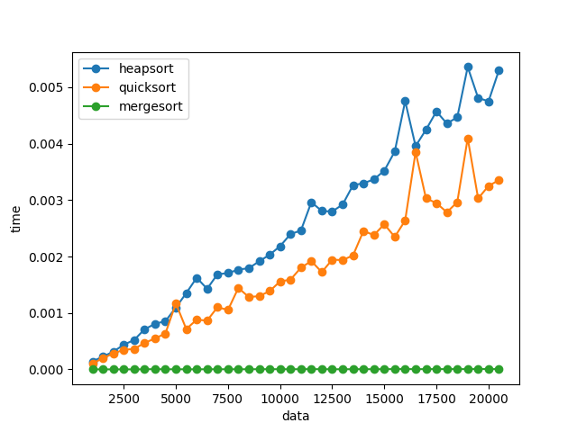
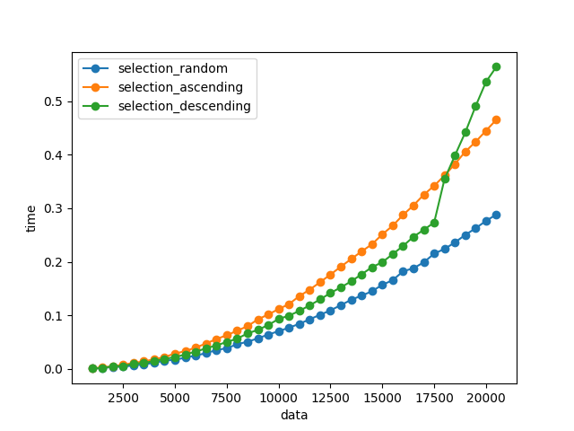
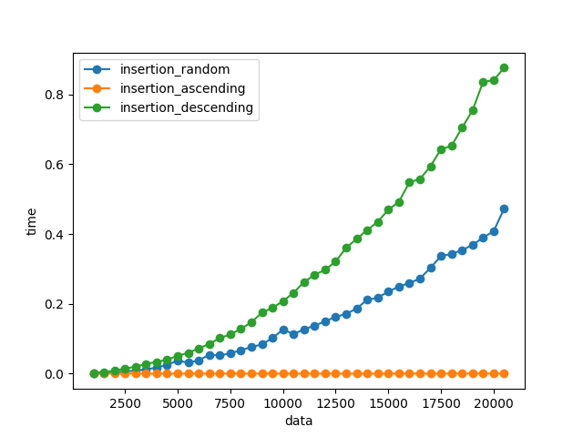
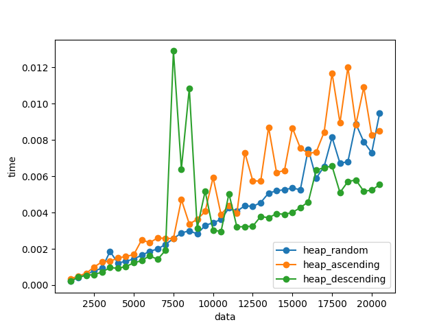
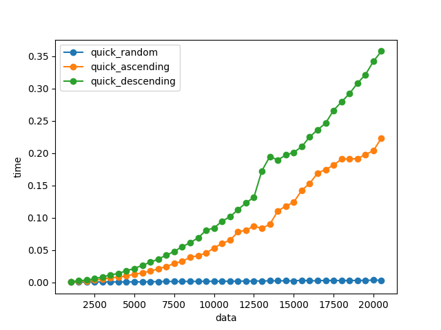
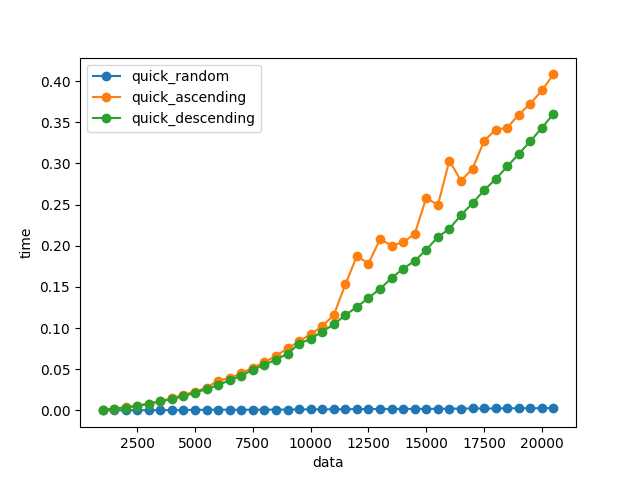
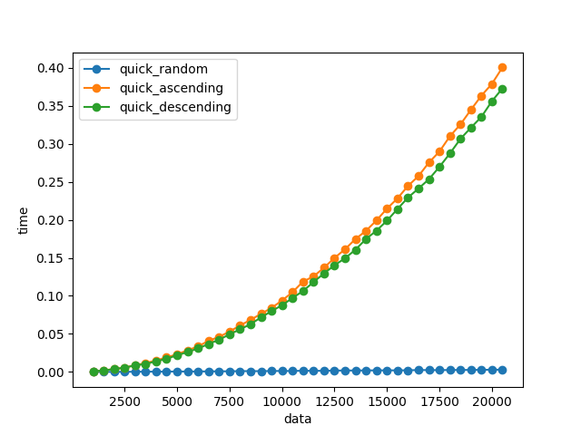

# SORT ALGORITHM

This repository includes:
- selection sort
- insertion sort
- heap sort
- quick sort
- merge sort

## Requirements
- python >= 3.6
- certifi==2020.12.5
- cycler==0.10.0
- kiwisolver==1.3.1
- matplotlib==3.3.3
- numpy==1.19.5
- pandas==1.2.0
- Pillow==8.1.0
- pyparsing==2.4.7
- python-dateutil==2.8.1
- pytz==2020.5
- six==1.15.0
- wincertstore==0.2

## Create an Environment

Step 1: Cloning this repository.

```bash
git clone https://github.com/yuta0306/algo_exp.git
```

Step 2: Changing your current directory.

```bash
cd algo_exp
```

Step 3: Creating the specific environmemnt.

You must run the cmd below:

```bash
pip install -r requirements.txt
```

If you use *Anaconda*, you can run below:

```bash
conda env -f env.yaml python=3.8
......
conda activate algo-exp
```

## Usage

```bash
python experiments.py
```

## Caution!

When you use *MacOS X*, you will encounter conflict errors.

You should change some namespaces such as *heapsort* and *mergesort*.

```c
// heapsort(...)
_heapsort(...)    // <--

// mergesort(...)
_mergesort(...)    // <--
```

## Results

### Exp A-1


### Exp A-2


### Exp A-3


### Exp B-1


### Exp B-2


### Exp B-3


### Exp B-4


### Exp C-1


### Exp C-2


### Exp C-3


### Exp C-4


### Exp C-5
